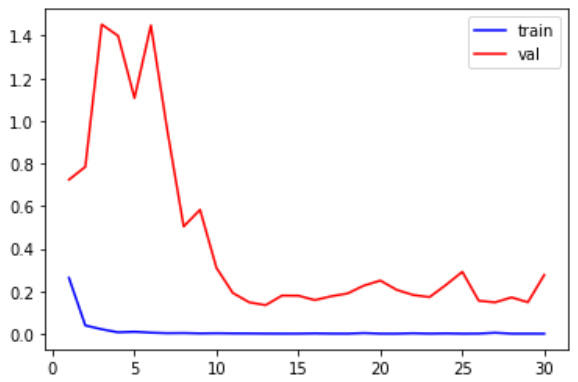
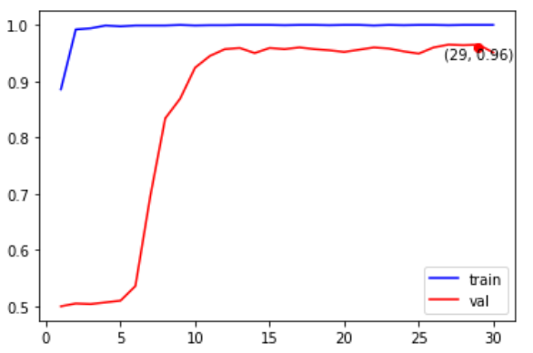

# ResNet50

基于keras实现ResNet50，并在猫狗分类数据集上测试效果。

ResNet介绍：https://mao-jy.github.io/2020/07/03/ResNet/

## 环境

python==3.6.10

tensorflow-gpu==2.2.0

keras==2.4.2

## 数据集

数据集来源于2014年kaggle猫狗分类竞赛：https://www.kaggle.com/c/dogs-vs-cats/data

将训练集(train.zip)解压后重新组织成下列形式（选择每个类别的前1000张作为训练集，接下来的500张作为验证集）：

```
|-- dogs-vs-cats-small
    |-- train
        |-- dogs
            |-- dog.0.jpg
            |-- ...
            |-- dog.999.jpg
        |-- cats
            |-- cat.0.jpg
            |-- ...
            |-- cat.999.jpg
    |-- val
        |-- dogs
            |-- dog.1000.jpg
            |-- ...
            |-- dog.1499.jpg
        |-- cats
            |-- cat.1000.jpg
            |-- ...
            |-- cat.1499.jpg
```

重新组织好的数据集：https://bhpan.buaa.edu.cn:443/link/1892A9F829B948DFE8A28C2BD20605E1

## 数据增强

未使用任何数据增强 。

## 预训练模型

使用keras提供的imagenet的预训练模型

包含全连接层：https://storage.googleapis.com/tensorflow/keras-applications/resnet/resnet50_weights_tf_dim_ordering_tf_kernels.h5

不含全连接层：https://storage.googleapis.com/tensorflow/keras-applications/resnet/resnet50_weights_tf_dim_ordering_tf_kernels_notop.h5

## 训练结果

### Loss变化



### Accuracy变化

